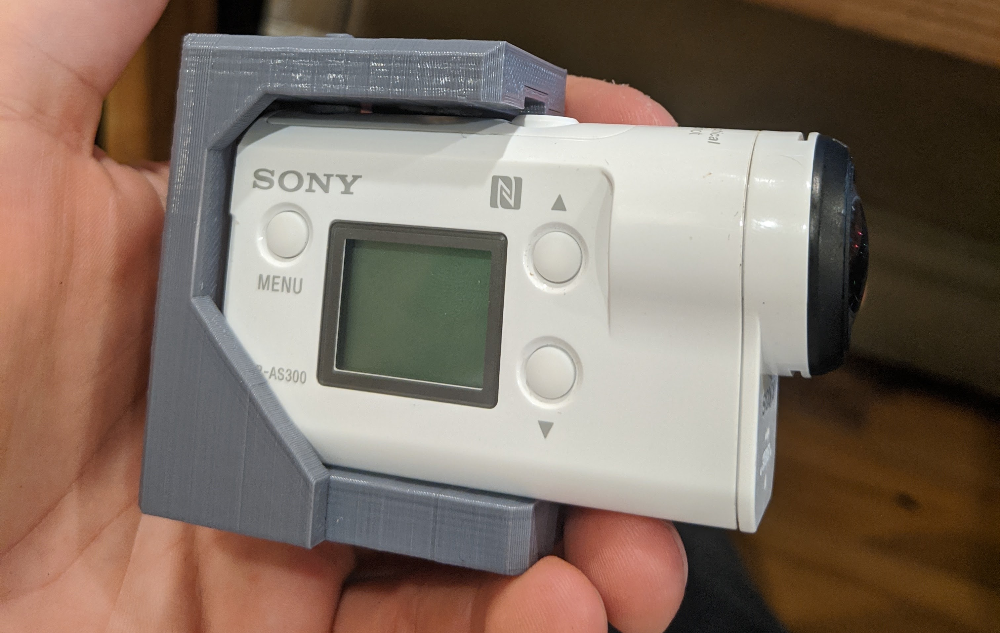

## AS300 Cold Shoe/Strain Relief Adapter

  

### About this print

I first came up with this idea over a year ago, when I wanted to mount my Rode VideoMic Go to the top of the AS300. This is a very versatile that not only allows you to mount cold shoe accessories, but it can also serve as a way
to protect your cables from becoming strained. The access port on the back of the print is adjusted to be tight enough to connectors to be able to epoxy cables to the print, protecting the connectors on your AS300. It also works just
fine without being epoxied.

I have plans to redesign the back of the print where the cables go, to create a template system that allows tight-fitting plates to be printed which fit the shape of various readily-available cables, to further increase the strain
protection. For now, it is a rectangular cut-out.

### STLs

- [strainrelief.stl](strainrelief.stl): The main body of the part. My prints used the following print settings:
    - 0.2mm layer height
    - 1.2mm wall thickness
    - 30% infill density
    - PLA+ filament at 218C

- [powerbutton.stl](powerbutton.stl): A power button that lets you power on/off the camera without taking it all apart.

### Necessary parts

- **3x** 1/4-20 nuts. I used brass, but any material works.
- **1x** 1/4-20 screw, ~8mm long. For mounting the camera to the holder. I purchased a longer screw, then used a hack saw to shorten it and a file to get rid of sharp edges.
- **2x** [Cold Shoe Mounting Plates.](https://www.amazon.com/SmallRig-Adapter-Bracket-Thread-Moniter/dp/B075M528JB) Screw these to the 3d printed mount if you want to use it to attach accessories like external mics or lights.

### Credit

- Created by tt2468 of IRLToolkit
